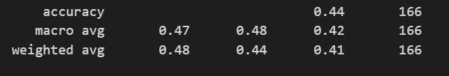
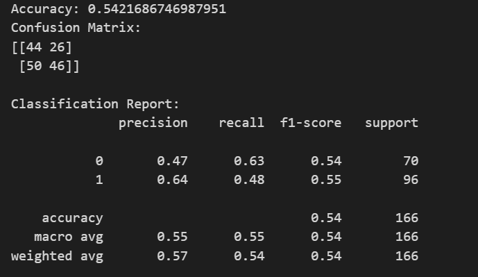

# Model Result Progress Notes

*these attempts were done with numerical categorical columns for state & city
*Only done on x input data predicting 'brainfog' symptom

## 1. SVC Molds with Location 
- PCA done with numerical category locations
- PCA scale not adjusted
- non specified Hyperparame

Research Notes
- I need to use a non linear kernel since I did not see a linear trend 
- kernel options to try: polynomial, Radial, Sigmoid 

Other Models to try
- SVM
- Random Forest 
- GBM 
- Neural Network 

Observations
- 44% accuracy 

## 2. SVC Molds
- Depending on the results of this, we will determine if location matters, if so, we will do new PCA with adjustments 
- 44% still bad, try a new model and check in with swagath over results

## 3. Random Forest Molds with location
Observations
- 50% - 55% Accuracy

    
## 4. Random Forest Mold
Observations
- 50 - 54% Accuracy
- really not much difference between the two
