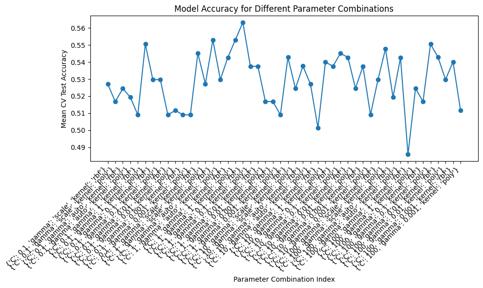
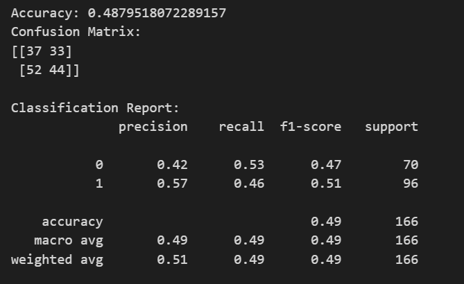

# Model Result Progress Notes

*these attempts were done with numerical categorical columns for state & city
*Only done on x input data predicting 'brainfog' symptom

Other Models to try
- SVM
- Random Forest 
- GBM 
- Neural Network 

# 1. SVC Molds 
Less than 60% Accuracy between all location and mold combos & 70-90% variance
## With Location 
- PCA done with numerical category locations
- PCA scale not adjusted
- non specified Hyperparameter

    Results
- 90% variance {'C': 1, 'gamma': 0.1, 'kernel': 'rbf'}: 56%

- 80% variance {'C': 1, 'gamma': 'scale', 'kernel': 'rbf'}: 56% accuracy 

## Without Location
- Depending on the results of this, we will determine if location matters, if so, we will do new PCA with adjustments 
Results
- 44% still bad, try a new model and check in with swagath over results

Research Notes
- I need to use a non linear kernel since I did not see a linear trend 
- kernel options to try: polynomial, Radial, Sigmoid
- 'rbf' and 'poly' kernels work best 

# 2. Random Forest Mold
Less than 60% Accuracy between all location and mold combos & 70-90% variance 
## With Location
Results
- 50% - 55% Accuracy

    
## Without Location
Results
- 50 - 54% Accuracy
- really not much difference between the two
