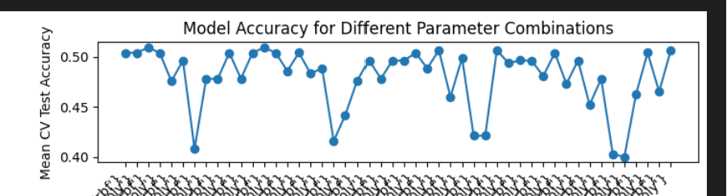
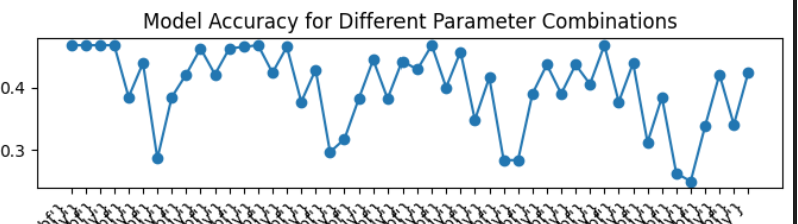
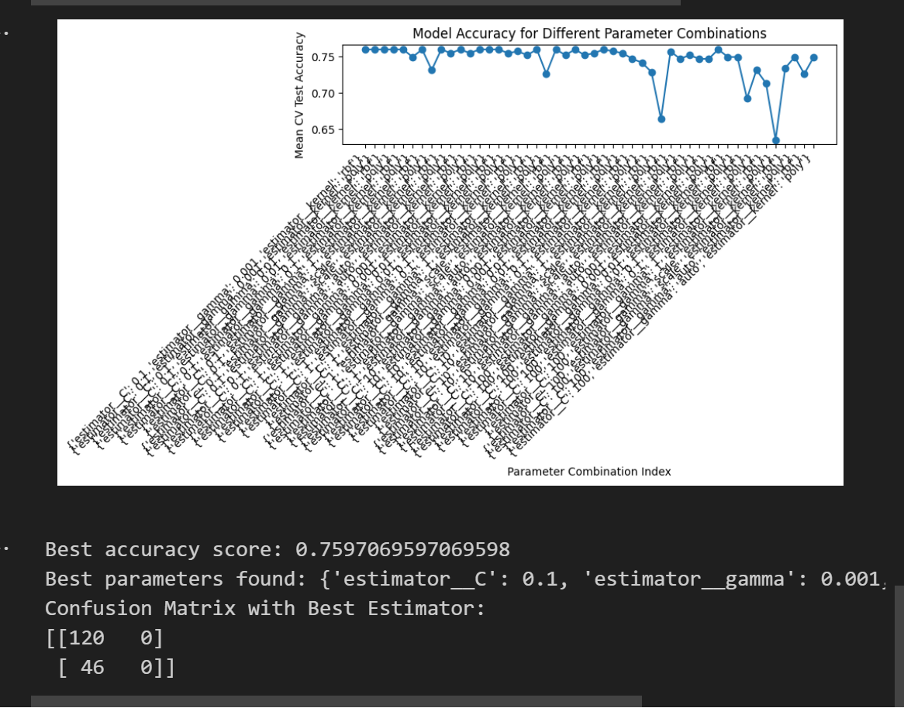
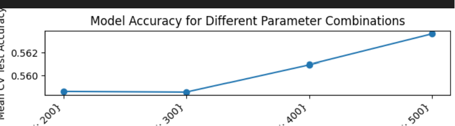
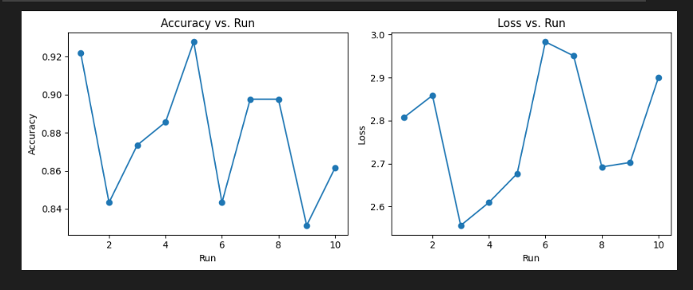
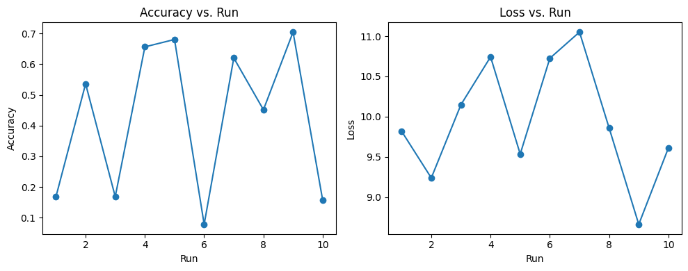

# Model Result Progress Notes

*these attempts were done with numerical categorical columns for state & city
*Only done on x input data predicting 'brainfog' symptom

Other Models to try
- SVM
- Random Forest 
- GBM 
- Neural Network 

# 1. SVC Molds 
Less than 60% Accuracy between all location and mold combos & 70-90% variance

## With Location 
- PCA done with numerical category locations
- PCA scale not adjusted
- non specified Hyperparameter


    Results
- 90% variance {'C': 1, 'gamma': 0.1, 'kernel': 'rbf'}: 57%


- 80% variance {'C': 1, 'gamma': 'scale', 'kernel': 'rbf'}: 56% accuracy 

Adding multi label predictions seem to drop the model even more: 45%


With full brain symptoms: 
Accuracy: 46.7% 


With just Brain_anger/aggresiveness 
Accuracy: 75%


something weird with the confusion matrix here, may be a mistake 

Yea stil seems not very sucessful

## Without Location
- Depending on the results of this, we will determine if location matters, if so, we will do new PCA with adjustments 
Results
- 44% still bad, try a new model and check in with swagath over results

Research Notes
- I need to use a non linear kernel since I did not see a linear trend 
- kernel options to try: polynomial, Radial, Sigmoid
- 'rbf' and 'poly' kernels work best 

# 2. Random Forest Mold
Less than 60% Accuracy between all location and mold combos & 70-90% variance 
## With Location
Inital Results
- 50% - 55% Accuracy


Results with Hyperparameter tuning:

Best Accuracy: 0.5895104895104895 <br>
Best parameters found: {'max_depth': 30, <br>
'min_samples_leaf': 2, <br> 
'min_samples_split': 5,<br>
 'n_estimators': 200}<br>
Confusion Matrix with Best Estimator:<br>
[[42 28]<br>
 [50 46]]

 With all symptoms doing multilabel classification

 

All symptoms 
Accuracy 56%
    
## Without Location
Results
- 50 - 54% Accuracy
- really not much difference between the two


 Honing more in on n_estimator parameters, testing more 
 
 odd, it went down but went back up when it raised, trying again

 it stays around 50s 

 Raising n_estimators: 
 200,500,1000 seems to go up? random all stays under 60%, around 50 - 58% range 

 Evaluating depth
seems to not have a consistent difference in performance. Pattern seems random 

Seems to not be a very fruitful model. Going to try out more

# 3. FCNN 

According to my research this works mostly for image data so I will use FCCN 

## Brain Symptoms 

```# Define the model
model = Sequential()
model.add(Dense(64, activation='relu', input_shape=(X_train.shape[1],)))
model.add(Dense(32, activation='relu'))
model.add(Dense(y_train.shape[1], activation='softmax'))  # Output layer with softmax

# Compile the model
model.compile(loss='categorical_crossentropy', optimizer='adam', metrics=['accuracy'])

# Train the model
model.fit(X_train, y_train, epochs=10, batch_size=32)
```

I got 86% Accuracy?? 

86 - 92% range

80/90% for non location, location seems to still not make much of a difference 

noticing this one is consistently high values

84% - 92% Range



Gonna check everything first
## Nervous System
Checking with Nervous system 
A little lower but not bad 
50 -70% range 

even worse very unfitted

## All

Gonna try it with all: 
ok when with all symptoms it went to 0 so I am going to play around more 

im noticing that as output labels increase, accuracy lowers. So the more complex the dataset the more complex the neural network should be 

For all others, it randomly jumps as low as 28 - 70 % 


# 4. GBM

