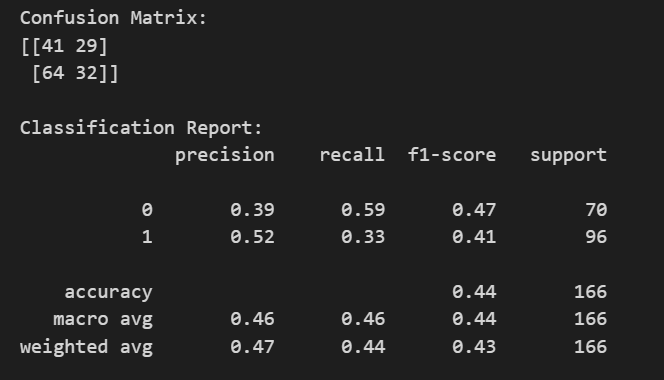

# Model Result Progress Notes

## 1. X = Molds with Location 
- PCA done with numerical category locations
- PCA scale not adjusted
- non specified Hyperparame

## 2. X = Molds
- Depending on the results of this, we will determine if location matters, if so, we will do new PCA with adjustments 

# 