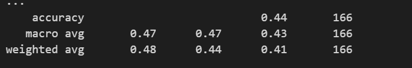

# Model Result Progress Notes

## 1. X = Molds with Location 
- PCA done with numerical category locations
- PCA scale not adjusted
- non specified Hyperparame

Research Notes
- I need to use a non linear kernel since I did not see a linear trend 
- kernel options to try: polynomial, Radial, Sigmoid 

Other Models to try
- SVM
- Random Forest 
- GBM 
- Neural Network 

Observations
- 44% accuracy 

## 2. X = Molds
- Depending on the results of this, we will determine if location matters, if so, we will do new PCA with adjustments 
- 44% still bad, try a new model and check in with swagath over results

# 